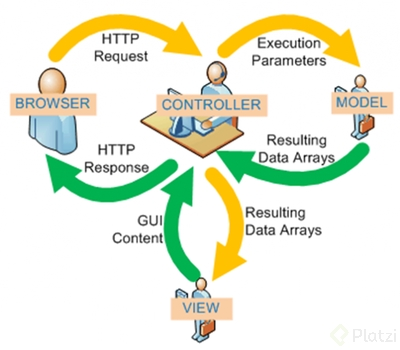
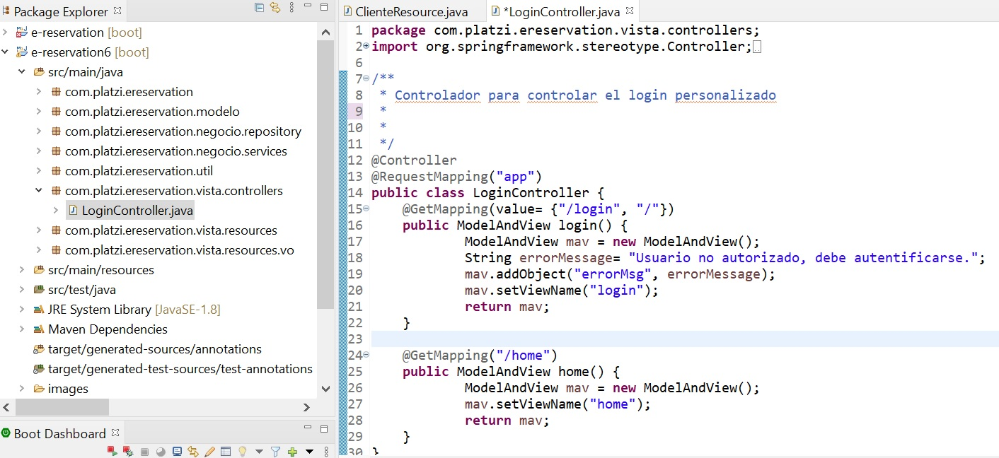
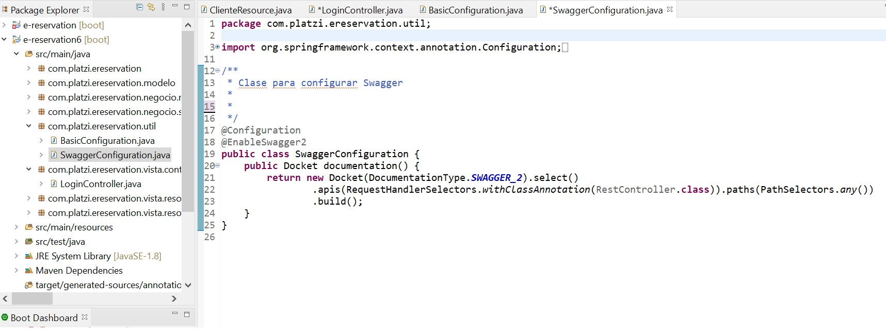

# Hibernate and Spring Course

## Table of contents
* [Introduction](#introduction) 
* [Technologies](#technologies)
* [Syntax](#syntax)
* [Illustrations](#illustrations)
*******************************************************
## Introduction
In this course we learned that the key difference between spring and hibernate is that spring is a complete and a modular framework for developing Enterprise Applications in Java while Hibernate is an Object Relational Mapping framework specialized in data persisting and retrieving from a database. 
*******************************************************
## Technologies
* Java 11
* EclipseIDE 2021-06
* Tomcat 10
* Maven 3.8
* Docker Desktop 3.5.2
* Postgres 11
* Spring tool suite 4.11
*******************************************************

## Syntax
#### ClienteService.Java
```java
/**
 * Clase para definir los servicios de cliente
 */
@Service
@Transactional(readOnly = true)
public class ClienteService {
	private final ClienteRepository clienteRepository;

	public ClienteService(ClienteRepository clienteRepository) {
		this.clienteRepository = clienteRepository;
	}

	/**
	 * Método para realizar la operación de guardar un cliente
	 * 
	 * @param cliente
	 * @return
	 */
	@Transactional
	public Cliente create(Cliente cliente) {
		return this.clienteRepository.save(cliente);
	}

	/**
	 * Método para realizar la operación de actualizar un cliente
	 * 
	 * @param cliente
	 * @return
	 */
	@Transactional
	public Cliente update(Cliente cliente) {
		return this.clienteRepository.save(cliente);
	}

	/**
	 * Método para realizar la operación de eliminar un cliente
	 * 
	 * @param cliente
	 */
	@Transactional
	public void delete(Cliente cliente) {
		this.clienteRepository.delete(cliente);
	}

	/**
	 * Método para consultar un cliente por su identificación
	 * 
	 * @param identificacionCli
	 * @return
	 */
	public Cliente findByIdentificacion(String identificacionCli) {
		return this.clienteRepository.findByIdentificacion(identificacionCli);
	}
	
	/**
	 * Método para consultar todos los clientes
	 * @return
	 */
	public List<Cliente> findAll(){
		return this.clienteRepository.findAll();
	}
	
	/**
	 * Método para buscar los clientes por su apellido
	 * @param apellidoCli
	 * @return
	 */
	public List<Cliente> findByApellidoCli(String apellidoCli){
		return this.clienteRepository.findByApellidoCli(apellidoCli);
	}
	
	/**
	 * Método para buscar un cliente por su cuenta de email
	 * @param email
	 * @return
	 */
	public Cliente findByEmailAccount(String email) {
		return this.findByEmailAccount(email);
	}
}
```
#### Main Dependencies
```
<dependencies>
		<dependency>
			<groupId>org.springframework.boot</groupId>
			<artifactId>spring-boot-starter-web</artifactId>
		</dependency>
		<!-- Lombok -->
		<dependency>
			<groupId>org.projectlombok</groupId>
			<artifactId>lombok</artifactId>
			<scope>provided</scope>
		</dependency>
		<!-- JPA y Postgres -->
		<dependency>
			<groupId>org.springframework.boot</groupId>
			<artifactId>spring-boot-starter-data-jpa</artifactId>
		</dependency>
		<dependency>
			<groupId>org.postgresql</groupId>
			<artifactId>postgresql</artifactId>
		</dependency>
		<!-- Swagger -->
		<dependency>
			<groupId>io.springfox</groupId>
			<artifactId>springfox-swagger2</artifactId>
			<version>2.7.0</version>
		</dependency>
		<dependency>
			<groupId>io.springfox</groupId>
			<artifactId>springfox-swagger-ui</artifactId>
			<version>2.7.0</version>
		</dependency>
		<!-- Seguridad -->
		<dependency>
			<groupId>org.springframework.boot</groupId>
			<artifactId>spring-boot-starter-security</artifactId>
		</dependency>
		<!-- Thymeleaf -->
		<dependency>
			<groupId>org.springframework.boot</groupId>
			<artifactId>spring-boot-starter-thymeleaf</artifactId>
		</dependency>
		<dependency>
			<groupId>org.springframework.boot</groupId>
			<artifactId>spring-boot-starter-test</artifactId>
			<scope>test</scope>
		</dependency>
</dependencies>
```
*******************************************************

## Illustrations
###### MVC Design

*******************************************************
###### Login Controller Code

*******************************************************
###### Swagger Configuration


